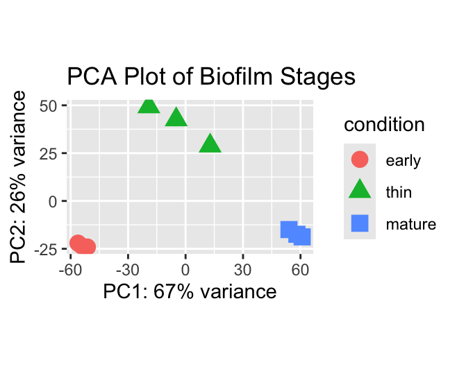
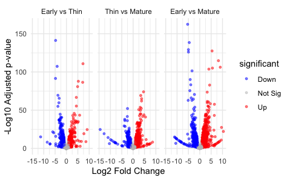
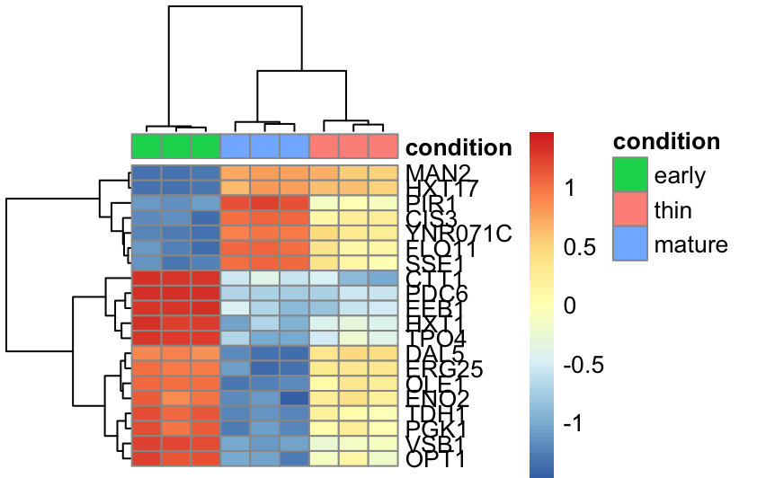
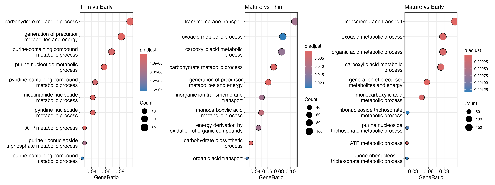

# yeast-biofilm-rnaseq
Differential gene expression analysis and functional enrichment/annotation analysis for biofilm maturation in flor yeast, Saccharomyces cerevisiae

**Author:** Rebekah Hest  
**Course:** BINF6110 - Genomic Methods for Bioinformatics

## Assignment 2

This repository contains Assignment 2, a study to examine differential expression in a bulk transcriptomics experiment and perform functional annotations for yeast biofilm (velum) development during wine aging. 

### Introduction

Biofilm formation is a part of a complex, dynamic aging process during sherry wine production (Carbonero-Pacheco et al., 2022). A strain of flor yeast, _Saccharomyces cerevisiae_, is responsible for the biochemical changes needed to survive the stressful conditions of biological aging (Mardanov et al., 2020). The structure formed on the air-liquid interface of the wine (flor velum) acts as a protective barrier in oxidative metabolism and contributes to the aroma and flavour development (Moreno-Garcia et al., 2017). The developmental transition from early biofilm to mature velum reflects a robust, specialized response to environmental and nutritional changes.
  
	The adaptations underpinning the regulation of flor formation can be characterized through the expression of specific genes (Legras et al., 2016).  Bulk RNA sequencing (RNA-seq) is a comprehensive and cost-effective approach for quantifying transcript abundance and identifying genes that are differentially expressed between experimental conditions (Wang et al., 2009). Comparison of transcriptional profiles across early, thin, and mature biofilm stages can reveal the molecular pathways and regulatory networks underlying velum development. However, detecting transcriptome changes requires a rigorous statistical framework for count-based RNA-seq data to account for biological variability, technical noise, and handle multiple hypothesis testing (Love et al., 2014).
    
Several computational tools have been developed for differential expression analysis (DEA), including DESeq2, edgeR, and limma-voom (Kalantari-Dehaghi et al, 2025). DESeq2 and edgeR model count data using the negative binomial distribution, whereas limma-voom estimates precision weights within a linear modeling framework (Robinson et al., 2009; Law et al., 2014). However, DESeq2 incorporates shrinkage estimations for dispersion and fold changes to improve statistical stability in experiments with small to moderate sample sizes (Love et al., 2014).
  
Pathway analysis can be performed using overrepresentation analysis (ORA) or gene set enrichment analysis (GSEA). ORA evaluates whether predefined gene sets are significantly expressed between conditions in a hypergeometric distribution and assumes genes in a pathway are independent of each other (Ashburner et al., 2000; Khatri et al., 2012). In contrast, GSEA analyzes a ranked gene list to detect subtle, pathway-level changes (Subramanian et al., 2005). Because this dataset includes clear stage-specific contrasts with robust differential expression, ORA was selected to identify significantly enriched biological processes in a straightforward and interpretable manner.

### Methods

#### Data Acquisition

RNA-seq data were obtained from the NCBI BioProject PRJNA592304, which includes transcriptomic profiles of _Saccharomyces cerevisiae_ during early, thin, and mature biofilm (velum) development. Three biological replicates were available per developmental stage. Raw sequencing reads were downloaded from the Sequence Read Archive (SRA) using the SRA Toolkit (v3.2.1) (`prefetch` and `fasterq-dump`). The _Saccharomyces cerevisiae_ reference transcriptome (GCF_000146045.2_R64) was retrieved from the NCBI RefSeq database in FASTA format for transcript quantification. 

#### Quality Control

Quality assessment of raw sequences was performed using FastQC (v0.12.1) to evaluate read quality scores, lengths and GC content (`fastqc`). No trimming was performed to reduce the noted impact of aggressive base removal on gene expression estimates (Williams et al., 2016).
	
#### Transcriptome Quantification

RNA-seq quantification was performed using Salmon (v1.10.34), a pseudoalignment tool that accurately estimates transcript abundance and models biases comparable to splice-aware alignment methods while substantial reducing computational time and storage requirements (Patro et al., 2017; Schaarschmidt et al., 2020). A transcriptome index was constructed from the reference (`index`) with default k-mer length parameters. Transcripts were quantified independently using quasi-mapping (`salmon quant`) command with automatic library selection (`-l A`) and selective alignment (`--validateMappings`) against the index library.
	
#### Differential Expression Analysis

Transcript-level abundances estimated using Salmon were imported into R (v2026.01.1+403) using the `tximport` package (v1.36.1). Quantification data was converted to gene-level counts using a mapping derived from the reference GTF annotation. Differential expression analysis (DEA) was performed using DESeq2 (v1.48.2) to fit a negative binomial GLM with biofilm stage as the condition (`DEQeq`). Wald tests were applied to estimate log2 fold changes between conditions, and p-values were adjusted for multiple testing using the Benjamini–Hochberg false discovery rate method (Love et al., 2014). Abundance estimates were normalization via Variance stabilizing transformation (VST) (`vst`). Principal component analysis (PCA) was performed to assess global differences between biofilm stages. Shrinkage was applied to the normalized DEA results using the apeglm method (`lfcShrink`) and MA plots were generated to display log fold change relative to mean expression counts. Volcano plots were generated to visualize significantly up- and downregulated genes (adjusted p-value < 0.05; log2 fold change > 1). A heatmap was produced for the top 20 most significantly expressed genes using the pheatmap package (v1.0.13).

#### Functional Annotation

Gene Ontology (GO) enrichment analysis was performed using the clusterProfiler package (v4.16.0) for overrepresentation analysis (ORA) to identify biological processes (BP) (`enrichGO`). The Saccharomyces Genome Database’s (SGD’s) was used for annotating (org.Sc.sgd.db) where the open reading frames (ORF) (or systematic names) were used as the gene IDs (Dwight et al., 2002). The background gene universe was composed of all unique genes modelled in the DEA. Statistical significance was calculated using the hypergeometric distribution with Benjamini–Hochberg (BH) correction (adjusted p-value < 0.05). Enriched GO terms were visualized using a dot plot. 

### Results

#### Global Transcriptome Differences Among Biofilm Development Stages

Principal Component Analysis (PCA) revealed distinct clustering by condition (biofilm stage) where the two components retained explained 94% of the total variance (Figure 1). PC1 (67% variance) separated the early stage from the mature stage, while PC2 (26% variance) distinguished the thin intermediate stage. A total of 2022 differentially expressed genes (DEGs) were identified between the early and thin stages, 2374 DEGs between the thin and mature stages, and 2993 genes were significantly expressed between the early and mature stages (p-value < 0.05).

 
**Figure 1. Principal component analysis (PCA) of transcriptomic profiles across early, thin, and mature biofilm stages.**
Variance-stabilized transformed (VST) counts used for dimensionality reduction. Each point represents one biological replicate (n = 3 per stage). Samples cluster according to developmental stage and the two principal components explain 93% of the variance. 
 

#### Stage-Specific Differential Expression Patterns

Comparative volcano plots further illustrated progressive transcriptional divergence across biofilm development stages (Figure 2). A threshold of at least two-fold changes in expression was applied following shrinkage which reduced the number of significant DEGs in each pairwise condition comparison. The comparison between early and thin stages identified 937 genes, with 485 upregulated and 453 downregulated. The thin versus mature contrast found 1091 genes above the threshold where 625 were upregulated and 466 downregulated. The most pronounced divergence was observed between early and mature stages containing 1716 genes in which 947 genes were upregulated and 769 genes were downregulated. 

 
**Figure 2. Volcano plots of differential gene expression across pairwise biofilm stage comparisons.**
Comparisons derived from shrunken log2 fold changes. Each point represents a gene with adjusted p-value < 0.05 and |log2FC| > 1 where red is upregulated, blue is downregulated, and gray represents non-significant genes.
 

Examining the top 20 significant DEGs revealed clear stage-specific expression patters, including distinct clusters of gene expression levels within stages and differing gene expression level groupings among stages (Figure 3).

 
**Figure 3. Heatmap of the top 20 significantly differentially expressed genes in the mature vs early biofilm stage comparison.**
Genes were ranked by adjusted p-value with Benjamini–Hochberg correction. Columns represent biological replicates grouped by developmental stage, and rows represent genes labeled by standard gene names. Hierarchical clustering evidenced across biofilm stages.

#### Functional Enrichment Reveals Metabolic Reprogramming During Biofilm Maturation

Over-representation (or enrichment) analysis (ORA) was performed and highlighted temporal reconstruction throughout development (Figure 4). The transition from early to thin biofilm stages yielded the largest the most functional reprogramming with 122 significant enriched Gene Ontology (GO) Biological Process (BP) terms (adjusted p-value <0.05). The dominant functions during initial biofilm establishment surround metabolic processes and energy production signalling substantial metabolic activation. The lowest enrichment occurred between the thin and mature stages with 22 GO terms where the functions were primarily related small metabolic processes, molecule biosynthesis, and cellular transport. The early-to-mature comparison identified 66 enriched processes that heavily overlapped with those observed in the pairwise transitions, including weak acid metabolic processes and transmembrane transport. 

 
**Figure 4. Gene Ontology (GO) Biological Process (BP) enrichment across biofilm developmental transitions.**
Significantly differentially expressed genes (adjusted p-value < 0.05 and |log2FC| > 1) relative to the full gene universe calculated by over-representation analysis (ORA). Dotplots display the top 15 enriched GO terms for each pairwise comparison where dot size represents gene count, and color indicates adjusted p-value with Benjamini–Hochberg correction.

### Discussion

Understanding transcriptional modifications during biofilm maturation is vital to understand how flor yeast, Saccharomyces cerevisiae adapts to extreme environmental stress and optimizes wine aroma and sensory quality. In turn, identifying key expressed genes can be used to improve strain selection and industrial wine production (Pastor-Vega et al., 2023). This study aimed to characterize and quantify gene expression profiles at early, thin, and mature stages of velum formation using RNA-seq data and found significant functional variation during progressive biofilm maturation. Principal component analysis uncovered clear global differences indicating a transitional transcriptional profile across biofilm development stages.
  
Moreover, the increasing number and magnitude of differentially expressed genes across pairwise contrasts reflects a cumulative reprogramming of the transcriptome as biofilm develops. 
Progressive and dynamic transcriptomic reconstruction is a characteristic response to overcome environmental challenges (Vlaeminck et al., 2022; Cao et al., 2025). In yeast, coordinated activation of protective pathways alongside repression of growth-associated programs has been documented as an adaptation to environmental changes (Gasch et al., 2000; Berry & Gasch, 2008). The bidirectional transcriptional remodeling observed across biofilm development is consistent with this established survival strategy. The concurrent activation and repression of gene sets, coupled with the coordinated clustering of co-regulated genes, supports the presence of synchronized gene regulation during biofilm maturation.
  
  The early-to-thin transition was characterized by enrichment of pathways related to carbohydrate metabolism, nucleotide metabolism, ATP metabolic processes, and generation of precursor metabolites and energy. At the gene level, upregulation of hexose transporter HXT13 and alcohol dehydrogenase ADH7 signal activation of metabolic energy transfer necessary for initial biofilm establishment necessary in an oxygen-rich but nutrient-limited environment.
    
In contrast, the thin-to-mature transition unveiled the fewest biological processes, mainly involving carbohydrate metabolic processes and transmembrane support. Following establishment, biofilms utilize more specialized maintenance roles rather than broad metabolic activity (Guzmán-Soto et al., 2021; Wang et al., 2023). Upregulation of SNO2 and ENB1 aid the biofilm in oxidative stress tolerance and iron homeostasis, respectively indicating systematic regulation for sustained survival in a stressful environment.
  
The greatest number of enriched biological processes was observed in the early-to-mature comparison, reflecting cumulative transcriptomic adaptations across biofilm development stages. The predominant processes included organic acid metabolic processes, energy production pathways, and transmembrane transport, outlining the progressive shift reinforcing the reliance on respiratory metabolism. The entire biofilm maturation process involved upregulation of DSF1 and AIF1 to maintain redox equilibrium and regulate apoptosis necessary for long-term survival at the air-liquid interface (Wissing et al., 2004). 
  
Overall, this study demonstrates that flor biofilm development is driven by progressive and coordinated transcriptional reprogramming across early, thin, and mature stages. The cumulative enrichment of organic acid metabolism, energy production, and transmembrane transport processes highlights sustained oxidative adaptation as a central strategy to manage the stressful conditions of biological aging in a nutrient-limited environment.

## References

Ashburner, M., Ball, C., Blake, J., Botstein, D., Butler, H. Cherry, J. M., Davis, A. P., Dolinski, K., Dwight, S. S., Eppig, J. T., Harris, M. A., Hill, D. P., Issel-Tarver, L., Kasarskis, A., Lewis, A., Matese, J. C., Richardson, J. E., Ringwald, M., Rubin, G. M., & Sherlock, G. (2000) Gene Ontology: tool for the unification of biology. Nature Genetics, 25, 25–29. https://doi.org/10.1038/75556 
Berry D. B., & Gasch A. P. (2008). Stress-activated genomic expression changes serve a preparative role for impending stress in yeast. Molecular Biology of the Cell, 19(11), 4580-4587. https://doi.org/10.1091/mbc.e07-07-0680 
Cao, K., Wang, S., Wu, Q., & Huang, F. (2025). Dynamic transcriptomic and metabolomic adaptation mechanisms of Trifolium ambiguum under different durations of cold stress. Scientific Reports, 15, 38165 https://doi.org/10.1038/s41598-025-22148-2 
Carbonero-Pacheco J., Moreno-García J., Moreno J., García-Martínez T., & Mauricio J. C. (2021). Revealing the Yeast Diversity of the Flor Biofilm Microbiota in Sherry Wines Through Internal Transcribed Spacer-Metabarcoding and Matrix-Assisted Laser Desorption/Ionization Time of Flight Mass Spectrometry. Frontiers in Microbiology, 12, https://doi.org/10.3389/fmicb.2021.825756 
Dwight S. S., Harris M. A., Dolinski K., Ball C. A., Binkley G., Christie K. R., Fisk D. G., Issel-Tarver L., Schroeder M., Sherlock G., Sethuraman A., Weng S., Botstein D., & Cherry J. M. Saccharomyces Genome Database (SGD) provides secondary gene annotation using the Gene Ontology (GO). (2002). Nucleic Acids Research, 30(1), 69-72. https://doi.org/10.1093/nar/30.1.69 
Gasch, A. P., Spellman, P. T., Kao, C. M., Carmel-Harel, O., Eisen, M. B., Storz, G., Botstein, D., & Brown, P. O. (2000). Genomic expression programs in the response of yeast cells to environmental changes. Molecular Biology of the Cell, 11(12), 4241–4257. https://doi.org/10.1091/mbc.11.12.4241 
Guzmán-Soto, I., McTiernan, C., Gonzalez-Gomez, M., Ross, A., Gupta, K., Suuronen, E. J., Mah, T. F., Griffith, M., & Alarcon, E. I. (2021). Mimicking biofilm formation and development: Recent progress in in vitro and in vivo biofilm models. iScience, 24(5), 102443. https://doi.org/10.1016/j.isci.2021.102443 
Kalantari-Dehaghi M., Ghohabi-Esfahani N., & Emadi-Baygi M. (2025). From bulk RNA sequencing to spatial transcriptomics: a comparative review of differential gene expression analysis methods. Human Genomics, 20, 9. https://doi.org/10.1186/s40246-025-00884-w 
Khatri, P., Sirota, M., & Butte, A. J. (2012). Ten years of pathway analysis: current approaches and outstanding challenges. PLoS Computational Biology, 8(2). https://doi.org/10.1371/journal.pcbi.1002375 
Law, C. W., Chen, Y., Shi, W., Smyth, G. K. (2014).  voom: precision weights unlock linear model analysis tools for RNA-seq read counts. Genome Biology, 15, https://doi.org/10.1186/gb-2014-15-2-r29 
Legras J. L., Moreno-Garcia J., Zara S., Zara G., Garcia-Martinez T., Mauricio J.C., Mannazzu I., Coi A. L., Bou Zeidan M., Dequin S., Moreno J., & Budroni M. (2016). Flor Yeast: New Perspectives Beyond Wine Aging. Frontiers in Microbiology, 7, 503. https://doi.org/10.3389/fmicb.2016.00503 
Love, M. I., Huber, W., & Anders, S. (2014). Moderated estimation of fold change and dispersion for RNA-seq data with DESeq2. Genome biology, 15(12), 550. https://doi.org/10.1186/s13059-014-0550-8 
Mardanov A. V., Eldarov M. A., Beletsky A. V., Tanashchuk T. N., Kishkovskaya S. A., & Ravin N. V. (2020). Transcriptome Profile of Yeast Strain Used for Biological Wine Aging Revealed Dynamic Changes of Gene Expression in Course of Flor Development. Frontiers in Microbiology, 11, 538. https://doi.org/10.3389/fmicb.2020.00538 
Mardanov, A. V., Gruzdev, E. V., Beletsky, A. V., Ivanova, E. V., Shalamitskiy, M. Y., Tanashchuk, T. N., & Ravin, N. V. (2023). Microbial Communities of Flor Velums and the Genetic Stability of Flor Yeasts Used for a Long Time for the Industrial Production of Sherry-like Wines. Fermentation, 9(4), 367. https://doi.org/10.3390/fermentation9040367 
Moreno-García J., Mauricio J. C., Moreno J., & García-Martínez T. (2017). Differential Proteome Analysis of a Flor Yeast Strain under Biofilm Formation. International Journal of Molecular Sciences, 18(4), 720. https://doi.org/10.3390/ijms18040720 
Pastor-Vega N., Carbonero-Pacheco J., Mauricio J. C., Moreno J., García-Martínez T., Nitin N., Ogawa M., Rai R., & Moreno-García J. (2023). Flor yeast immobilization in microbial biocapsules for Sherry wine production: microvinification approach. World Journal of Microbiology and Biotechnology, 39(10), 271. https://doi.org/10.1007/s11274-023-03713-1 
Patro R., Duggal G., Love M. I., Irizarry R. A., & Kingsford C. (2017). Salmon: fast and bias-aware quantification of transcript expression using dual-phase inference. Nature Methods, 14(4), 417-419. https://doi.org/10.1038/nmeth.4197 
Robinson M. D., McCarthy D. J., & Smyth G.K. (2010) edgeR: a Bioconductor package for differential expression analysis of digital gene expression data. Bioinformatics, 26, 139-40. https://doi.org/10.1093/bioinformatics/btp616 
Schaarschmidt S., Fischer A., Zuther E., & Hincha D. K. (2020). Evaluation of Seven Different RNA-Seq Alignment Tools Based on Experimental Data from the Model Plant Arabidopsis thaliana. International Journal of Molecular Sciences, 21(5), 1720. https://doi.org/10.3390/ijms21051720 
Vlaeminck J., Lin Q., Xavier B. B., De Backer S., Berkell M, De Greve H, Hernalsteens JP, Kumar-Singh S, Goossens H, & Malhotra-Kumar S. (2022). The dynamic transcriptome during maturation of biofilms formed by methicillin-resistant Staphylococcus aureus. Frontiers in Microbiology, 13, 882346. https://doi.org/10.3389/fmicb.2022.882346 
Wang, Z., Gerstein, M. & Snyder, M. RNA-Seq: a revolutionary tool for transcriptomics. (2009). Nature Reviews Genetics, 10, 57–63. https://doi.org/10.1038/nrg2484 
Wang X., Liu M., Yu C., Li J., & Zhou X. (2023). Biofilm formation: mechanistic insights and therapeutic targets. Molecular Biomedicine, 4(1), 49. https://doi.org/10.1186/s43556-023-00164-w 
Williams, C. R., Baccarella, A., Parrish, J. Z., & Kim, C. C. (2016). Trimming of sequence reads alters RNA-Seq gene expression estimates. BMC Bioinformatics, 17, 103. https://doi.org/10.1186/s12859-016-0956-2 
Wissing S., Ludovico P., Herker E., Büttner S,. Engelhardt S. M., Decker T., Link A., Proksch A., Rodrigues F., Corte-Real M., Fröhlich K. U., Manns J., Candé C., Sigrist S. J., Kroemer G., & Madeo F. (2004 ). An AIF orthologue regulates apoptosis in yeast. Journal of Cell Biology, 166(7), 969-74. https://doi.org/10.1083/jcb.200404138 
Zara S., Gross M. K., Zara G., Budroni M., Bakalinsky A. T. (2010). Ethanol-Independent Biofilm Formation by a Flor Wine Yeast Strain of Saccharomyces cerevisiae. Applied and Environmental Microbiology, 76(12). https://doi.org/10.1128/AEM.00111-10 

